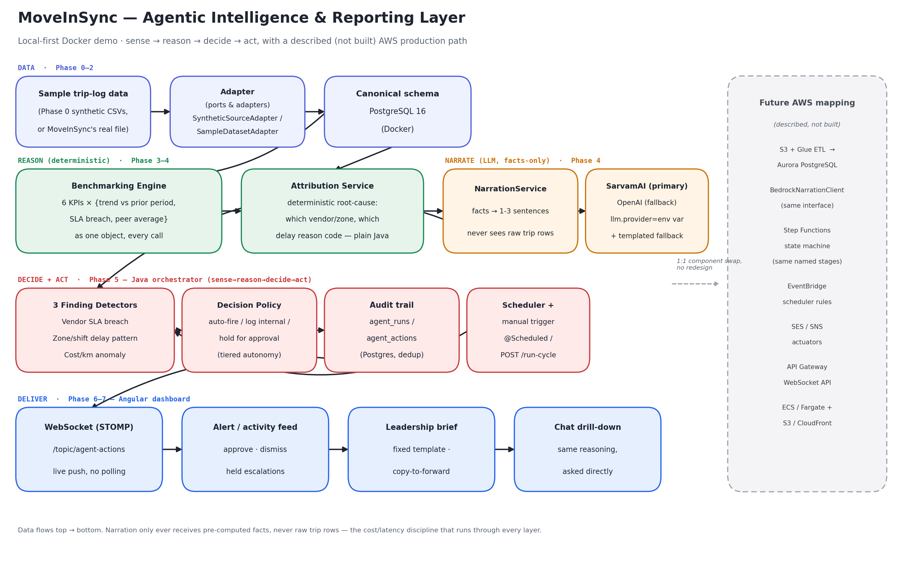

# Agentic Intelligence & Reporting Layer for Enterprise Mobility

MoveInSync hackathon submission. See `Claude outputs/` for the requirements analysis,
build plan, and architecture document these decisions come from.

## Stack
Java (Spring Boot) + Angular + PostgreSQL, all run locally via Docker Compose - no AWS
account or cloud credentials needed to run the demo. See `Claude outputs/MoveInSync_Architecture_Document.md`
for the full design (including the described, not-built, AWS production mapping).

## Prerequisites

- Docker Desktop (or another Docker Compose-compatible runtime), running.
- A SarvamAI or OpenAI API key if you want real LLM narration (optional - see "Switching the
  LLM provider" below; without a key every endpoint still works, just with a templated
  fallback sentence instead of a fluent one).
- Nothing else. No AWS account, no cloud credentials, no external services beyond the LLM
  provider - this whole stack runs on one `docker-compose up` on a laptop.

## Architecture



Canonical data model -> benchmarking engine -> attribution + narration -> Java orchestrator
(sense -> reason -> decide -> act) -> Angular delivery, with a described (not built) AWS
production path on the right. Full rationale and alternatives considered:
`Claude outputs/MoveInSync_Architecture_Document.md`.

## Project layout
```
backend/            Spring Boot app (Java 17, Maven)
frontend/           Angular app
data-generator/     Synthetic dataset generator (Phase 0) + ANSWER_KEY.md
data/               Generated CSVs + SCHEMA.md (input for Phase 2's ingestion layer)
docs/               Architecture diagram + the pitch deck (Phase 8)
sample-outputs/     Real captured API responses from live testing (Phase 8)
docker-compose.yml  Brings up postgres + backend + frontend together
```

## Running it

1. Copy `.env.example` to `.env` and fill in your SarvamAI/OpenAI API key(s) (needed from
   Phase 4 onward; Phase 1-3 don't call the LLM yet, so `.env` can stay mostly blank for now).
2. `docker-compose up --build`
3. Open http://localhost:4200 - the page should show backend status `UP` and database status `UP`.
   - Backend directly: http://localhost:8080/api/health
   - Postgres directly (e.g. via `psql` or a GUI client): `localhost:5432`, db `moveinsync`,
     user `moveinsync`, password from `.env`.

First build will take a few minutes (Maven downloads dependencies, npm installs Angular).
Subsequent `docker-compose up` runs are fast thanks to Docker layer caching.

## Switching the LLM provider

Narration (Phase 4 onward) goes through a single `NarrationClient` interface with two
implementations - swapping providers is a one-line config change, no redeploy, no code change:

```
# .env
LLM_PROVIDER=sarvam        # default; or:
LLM_PROVIDER=openai

SARVAM_API_KEY=...
SARVAM_MODEL=sarvam-105b-conversations   # SarvamAI deprecates model ids periodically -
                                          # if this one stops working, this is the only line to change

OPENAI_API_KEY=...
OPENAI_MODEL=gpt-4o-mini
```

Restart the backend after changing `.env` (`docker-compose up -d --force-recreate backend`
is enough - no rebuild needed, this is a runtime env var, not a code change). If a call fails
for any reason (bad key, outage, rate limit, wrong model id), `NarrationService` catches it
and falls back to a deterministic templated sentence built from the same facts - every
endpoint stays correct, just less fluent. Watch for `"usedFallback": true` in any response,
or `narrationProvider: "template-fallback"`.

## Regenerating the dataset

The generator is a build-time fixture script, not part of the deployed stack - it doesn't run
in Docker:

```
cd data-generator
python3 -m pip install --user pandas faker   # if not already installed
python3 generate_data.py
```

The random seed is fixed (42), so this reproduces the exact same dataset (and the exact same
planted stories - see `data-generator/ANSWER_KEY.md`) unless the script itself is edited.
After regenerating, reload it into a running stack with
`POST http://localhost:8080/api/admin/ingest?force=true` (see Phase 2 below), or just
`docker-compose up --build` from a clean volume.

## Sample outputs

`sample-outputs/` has real API responses captured live during build/testing - not
hand-written to look good, actual `curl`/browser output including a genuine SarvamAI round
trip. Useful as a reference for what to expect, or if a judge wants to see results without
running the stack. See `sample-outputs/README.md` for what each file demonstrates.

## Pitch deck

`docs/MoveInSync_Pitch_Deck.pptx` - the presentation: problem framing, architecture, a full
worked demo walkthrough with real captured numbers, the three-tier decision model, data
quality handling, evaluation-criteria mapping, and the AWS roadmap.

## Verifying Phase 2 (data ingestion)

On startup, the backend auto-loads `data/*.csv` into the canonical schema (see
`data/SCHEMA.md` and `backend/.../db/migration/V2__canonical_schema.sql`) - but only if the
tables are empty, so restarts don't reload/duplicate data.

- `GET http://localhost:8080/api/admin/ingestion-status` - row counts per table, the last
  ingestion run, and the data-quality findings from the messiness Phase 0 planted (duplicate
  trip rows, unmatched trip_employees, incomplete rosters, missing GPS traces - all loaded and
  flagged, not dropped or crashed on).
- `POST http://localhost:8080/api/admin/ingest?force=true` - truncates and reloads (e.g. after
  regenerating `data/*.csv`, or once a real `SampleDatasetAdapter` is added).

## Verifying Phase 3 (benchmarking engine)

- `GET http://localhost:8080/api/benchmarks/metrics` - the six tracked KPIs and their SLA
  thresholds (On-Time Arrival Rate, Average Delay, Cost per Km, Cost per Trip, Safety Incident
  Rate, Feedback Score).
- `GET http://localhost:8080/api/benchmarks/latest-data-date` - the date benchmarking treats as
  "now" (the dataset's own latest date, not the real clock - the sample is a fixed historical
  window, see BenchmarkingService's Javadoc).
- `GET http://localhost:8080/api/benchmarks?metric=ON_TIME_ARRIVAL_RATE&dimension=VENDOR&windowDays=28`
  - this is the planted Vendor A / Vendor E OTA-degradation story (see
  `data-generator/ANSWER_KEY.md`): Vendor A and Vendor E should show a real trend drop and an
  SLA breach (`slaBreached: true`) that the other three vendors don't.
- Swap `dimension=ZONE` to see the Marathahalli/Night-Shift delay pattern show up as a zone
  outlier, or try `metric=COST_PER_KM` to see Vendor B's cost creep.
- `dimension=NONE` gives the fleet-wide number with no peer comparison (peerAverageValue is
  null there, by design - there's no "peer" at fleet level).

## Verifying Phase 4 (attribution + narration)

Set `SARVAM_API_KEY` (or `OPENAI_API_KEY` with `LLM_PROVIDER=openai`) in `.env` first if you
want to see real LLM narration - without a key, the endpoint still returns everything except
the LLM's phrasing (see `usedFallback` below).

- `GET http://localhost:8080/api/insights/on-time-gap?windowDays=28` - the brief's own worked
  example, computed and narrated end to end: fleet OTA vs SLA/trend, decomposed to which
  vendors are responsible for the shortfall and their dominant delay reason, then narrated
  into 1-3 sentences.
  - `attribution.topContributors` should show Vendor A (V1) and Vendor E (V5) at the top,
    each accounting for a large share of fleet-wide late trips, both with `driver_late` as
    their dominant reason code - this is `data-generator/ANSWER_KEY.md`'s planted story,
    found and explained without being told where to look.
  - `factsSummary` is the exact deterministic text handed to the LLM - every number in
    `narrative` should trace back to a line here.
  - `usedFallback: true` means the configured LLM call failed (no key set, wrong API shape,
    no network) and a templated (still correct, less natural) summary was used instead -
    check the backend logs for why. See SarvamAiNarrationClient's Javadoc: its exact request
    shape wasn't verified against a live key and may need a small adjustment.

## Verifying Phase 5 (agent orchestrator: sense -> reason -> decide -> act)

The agent pipeline runs on two schedules (nightly for vendor/cost rollups, every 15 minutes
for operational/structural checks - see `AgentScheduler`), but for a live demo, trigger a
cycle on demand instead of waiting on the clock:

- `POST http://localhost:8080/api/agent/run-cycle` - runs sense -> reason -> decide -> act
  right now, anchored to the dataset's own latest date. Returns a summary: how many findings
  were detected, how many became actions (vs. deduped against a recent open finding), and the
  actions themselves (title, decided status, narrated text).
  - First run should surface all three planted stories as findings: the Vendor A/E OTA SLA
    breach (`VENDOR_SLA_BREACH`, held `PENDING_APPROVAL` - vendor-facing), the
    Marathahalli/Night-Shift delay pattern (`ZONE_SHIFT_DELAY_PATTERN`, `AUTO_FIRED` -
    internal/low-stakes), and Vendor B's cost/km creep (`COST_ANOMALY`, `LOGGED_INTERNAL` -
    less certain, logged for billing review rather than escalated).
  - Run it again immediately: `actionsCreated` should drop to 0 and `actionsDeduped` should
    pick up the same count - the same findings aren't re-flagged every cycle (see
    `AgentAuditRepository.hasRecentOpenFinding`, a 5-day dedup window).
- `GET http://localhost:8080/api/agent/actions` - the full audit trail (add `?status=PENDING_APPROVAL`
  to filter). Every action's `facts_summary` is the deterministic text handed to the LLM, and
  `narrative` is what came back - same "the LLM never sees raw data" contract as Phase 4.
- `GET http://localhost:8080/api/agent/runs` - one row per pipeline execution (manual or
  scheduled), with counts.
- `POST http://localhost:8080/api/agent/actions/{id}/approve` - the one human click a
  `PENDING_APPROVAL` action (the vendor-facing escalation) is waiting for. Logs a mocked
  "would have sent this" (see backend logs) rather than actually emailing/SMS-ing anyone -
  there's no real external system to notify in an offline demo, per the architecture doc.
- `POST http://localhost:8080/api/agent/actions/{id}/dismiss` - marks it dismissed instead.

## Verifying Phase 6 (persona output + live WebSocket delivery)

Rebuild both backend (new Java classes) and frontend (new components + `@stomp/stompjs`
dependency):

```
docker-compose up --build
```

- Open http://localhost:4200 - below the system status card you should now see two new
  sections:
  - **Agent activity** - a live feed, seeded from `GET /api/agent/actions` on load, then
    updated in real time over a STOMP WebSocket (`/ws`, see backend's `WebSocketConfig`) the
    instant AgentOrchestrator decides a new action - no refresh, no polling. Click "Run agent
    cycle now" to trigger a cycle from the UI itself and watch entries appear live. Vendor SLA
    breaches show "Approve & send" / "Dismiss" buttons (the `PENDING_APPROVAL` tier) - approving
    logs a mocked "would have sent this" in the backend logs and flips the card to "Approved".
  - **Leadership brief** - the transport & facilities head's persona-specific output
    (`GET /api/persona/leadership-brief`): a fixed-template brief with a narrated executive
    summary, the fleet-wide KPI snapshot (with SLA/trend context on every number), the top
    open findings (reusing Phase 5's already-narrated text, no extra LLM calls), and any
    metrics currently trending favorably within SLA ("wins"). "Copy brief" copies a
    plain-text version ready to paste into an email - the "forward without rework" bonus
    criterion made literal.
- To see a second browser tab update in real time with no action on its part, open
  http://localhost:4200 in two tabs, trigger a run from one, and watch the activity feed
  update in the other.

## Verifying Phase 7 (optional: conversational drill-down)

```
docker-compose up --build
```

- Open http://localhost:4200 and scroll to **Ask the agent** below the leadership brief.
- Try the suggested questions, or type your own:
  - "Why did on-time arrival drop this week?" - runs the exact same `AttributionService`
    decomposition as `/api/insights/on-time-gap` and Phase 5's `VendorSlaBreachDetector`,
    should surface Vendor A/E again.
  - "How is Vendor A doing on cost?" - detects the vendor mention (`ChatLookupRepository`
    matches "Vendor A" against the `vendors` table), pulls `COST_PER_KM` for that vendor plus
    a full fleet ranking.
  - "Any safety concerns lately?" - `SAFETY_INCIDENT_RATE`, fleet + vendor ranking (should
    surface Vendor D given D0007's incident cluster, if the window catches it).
  - "What is happening in Marathahalli?" - detects the zone mention, benchmarks
    `AVERAGE_DELAY_MINUTES` by zone, flags Marathahalli in the ranking.
  - Ask something unrelated to any keyword ("how's the fleet doing overall?") and it should
    fall back to a full 6-metric snapshot rather than erroring.
- Every answer is still deterministic reasoning (`ChatService` calls the same
  `AttributionService`/`BenchmarkingService` everything else uses) phrased by
  `NarrationService` - a bad/rate-limited LLM call still returns a correct, if less fluent,
  answer (watch for the "templated fallback" tag on a reply).
- `POST http://localhost:8080/api/chat` with `{"message": "..."}` directly, if you want to see
  the raw JSON (`factsSummary`, `matchedSubject`, `vendorId`/`zone` detected, `usedFallback`).

## Verifying Phase 8 (packaging)

- `docs/architecture-diagram.png` - the diagram embedded above, also used in the pitch deck.
- `docs/MoveInSync_Pitch_Deck.pptx` - open it, or convert to PDF for a quick look:
  `soffice --headless --convert-to pdf docs/MoveInSync_Pitch_Deck.pptx` (LibreOffice) or just
  open it in PowerPoint/Keynote/Google Slides.
- `sample-outputs/` - real captured JSON/text, see `sample-outputs/README.md`.
- This README itself: `docker-compose up --build` is still the only setup instruction, with
  the LLM provider switch and dataset regeneration now called out as their own sections above.

## Deploying to Render (free tier)

The stack (Postgres + Spring Boot backend + Angular/nginx frontend) also runs as a
[Render Blueprint](https://render.com/docs/blueprint-spec) using only Render's free
services - no other cloud account or credit card needed. `render.yaml` (repo root)
defines all three pieces; nothing outside this repo needs to be created by hand except
two API-key secrets.

**What changed vs. the local Docker Compose setup** (Compose itself is untouched and
still works exactly as before):

- `backend/Dockerfile` now also bakes `backend/data/*.csv` into the image
  (`COPY data/ /data/`), since Render has no bind-mount equivalent to Compose's
  `./data:/data:ro`. Locally, Compose's bind mount still shadows this at runtime, so
  local behavior is unchanged.
- `backend/src/main/resources/application.yml`'s datasource URL and server port are now
  environment-driven with fallbacks: Compose keeps setting `SPRING_DATASOURCE_URL`
  directly (unchanged), while Render (which has no single connection-string env var by
  default) assembles the URL from `DB_HOST`/`DB_NAME`, which `render.yaml` wires from the
  free Postgres instance automatically.
- `frontend/nginx.conf` became `frontend/nginx.conf.template`, using `${PORT}` and
  `${BACKEND_HOSTPORT}` instead of the hardcoded `80` / `backend:8080`. This relies on the
  official `nginx:1.27-alpine` image's built-in behavior: any file under
  `/etc/nginx/templates/*.template` is `envsubst`-processed into `/etc/nginx/conf.d/`
  before nginx starts - no custom entrypoint script needed. `BACKEND_HOSTPORT` is wired by
  `render.yaml` from the backend service's private-network `hostport`
  (`fromService: { property: hostport }`), so the frontend reaches the backend over
  Render's internal network - no public URL, no CORS setup, no Angular code changes.

**Steps to deploy:**

1. Push this repo to GitHub (if it isn't already).
2. In the Render dashboard: **New -> Blueprint**, connect the repo, and let Render read
   `render.yaml`. It will provision one free Postgres database and two free Docker web
   services (`moveinsync-backend`, `moveinsync-frontend`).
3. Before (or right after) the first deploy, open `moveinsync-backend` -> **Environment**
   and set `SARVAM_API_KEY` and `OPENAI_API_KEY` manually. These are marked `sync: false`
   in `render.yaml` on purpose, so the keys are never committed to the repo - the same
   discipline as the local `.env` file.
4. Wait for both services to build and go live, then open the frontend service's
   `onrender.com` URL.

**Free-tier caveats worth knowing before a demo:**

- Free web services spin down after 15 minutes idle and take roughly a minute to wake
  back up on the next request - hit both URLs a minute or two before judging starts.
- The free Postgres database expires 30 days after creation (14-day grace period after
  that). Fine for a hackathon demo; recreate it if the deployment needs to outlive that
  window.
- Free services get 750 shared instance-hours/month combined, which is more than enough
  for two low-traffic demo services.


## Current status: all phases complete (0 through 8 - mandatory, good-to-have, and packaging)

- [x] Phase 0 - synthetic dataset (`data/`, `data-generator/`)
- [x] Phase 1 - Docker Compose skeleton: postgres + backend + frontend running together,
      with a working health-check round trip (Angular -> nginx -> Spring Boot -> Postgres)
- [x] Phase 2 - canonical schema (`V2__canonical_schema.sql`) + `SyntheticSourceAdapter` loads
      `data/*.csv` into Postgres on startup, with post-load data-quality checks recorded to
      `data_quality_issues` (see the ingestion-status endpoint above)
- [x] Phase 3 - `BenchmarkingService`: six KPIs, each returned with trend-vs-prior-period,
      vs-SLA, and vs-peer context as a single object (the brief's mandatory contextualization
      requirement) - sliced by vendor or zone, anchored to the dataset's own latest date, with
      duplicate trip rows deduped in every query
- [x] Phase 4 - `AttributionService` (deterministic root-cause decomposition: which vendors,
      what reason codes) + `NarrationService` (SarvamAI/OpenAI, config-switched, falls back to
      a templated summary on any failure) - tied together in `/api/insights/on-time-gap`,
      verified end to end with a real SarvamAI response (`sarvam-105b-conversations`)
- [x] Phase 5 - agent orchestrator: three `FindingDetector`s (vendor SLA breach, zone/shift
      structural delay pattern, cost/km anomaly) feeding a `DecisionPolicy` that tiers actions
      (auto-fired / logged-internal / pending-approval), a Postgres audit trail
      (`agent_runs`/`agent_actions`), dedup so the same finding doesn't re-fire every cycle,
      `@Scheduled` triggers plus a manual `/api/agent/run-cycle` endpoint for live demos -
      verified live: all three planted stories surface with the right decision tier each,
      and repeat runs dedupe instead of re-firing
- [x] Phase 6 - `WebSocketConfig` (STOMP over `/ws`) + `AgentOrchestrator` broadcasting every
      decided action to `/topic/agent-actions` in real time; Angular's `AgentActivityLogComponent`
      (live feed, seeded from REST history, approve/dismiss for held escalations) and
      `LeadershipBriefComponent` (persona-specific, fixed-template, copyable) - `nginx`/dev-proxy
      both updated to pass the WebSocket upgrade through
- [x] Phase 7 - `ChatService` (keyword-based intent routing to the SAME attribution/
      benchmarking/narration services as the rest of the app, `ChatLookupRepository` for
      vendor/zone name matching) + `POST /api/chat`; Angular's `ChatComponent` - proves
      "combined multiple output forms" (proactive alerting + narrative brief + conversational
      chat) over one shared reasoning layer, not three separate pipelines
- [x] Phase 8 - `docs/architecture-diagram.png` (also embedded above), `docs/MoveInSync_Pitch_Deck.pptx` (12-slide deck built from real captured demo output, not placeholder numbers), `sample-outputs/` (genuine live API responses with a README mapping each to its planted story), and this final README pass (prerequisites, provider-switch, dataset regeneration, and packaging sections)

See `Claude outputs/MoveInSync_Build_Plan.md` for the full phase-by-phase plan.
